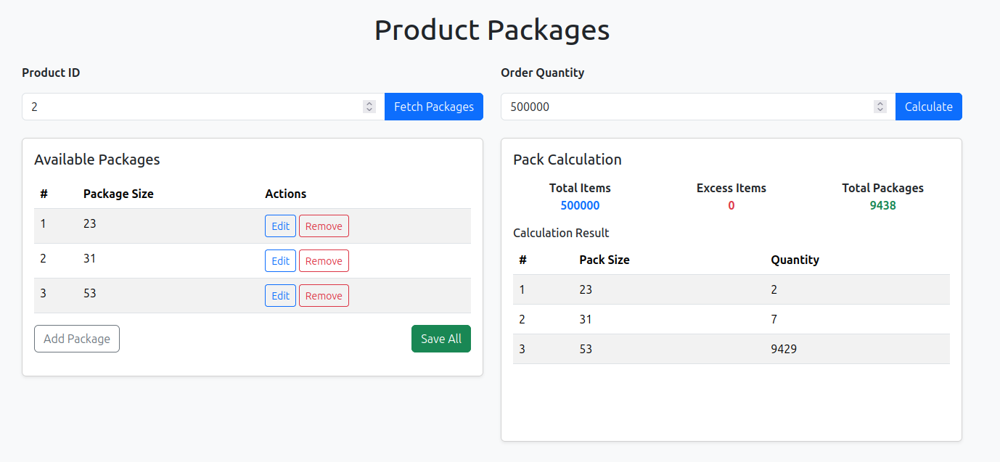

# shipping-optimizer
An exercise implementation of shipping packages optimizer based on different packing sizes and ordered amount

## Makefile Commands
make run:          # Run Locally 
make test:         # Unit Tests 
make build:        # Production Build 
make vet:          # Code Quality Checks 
make docker-build: # Generate Docker Image (requires Docker) 
make docker-up:    # Run locally in a Docker Container (requires Docker) 
make docker-down:  # End Docker Container Execution (requires Docker) 

## API Endpoints Examples
Retrieve the package sizes of a given product 
GET 'http://localhost:8080/product/1/packsizes' 
Response: 
{ 
    "pid": 1, 
    "packs": [ 23, 31, 53 ] 
} 

Setup the package sizes of a given product 
POST 'http://localhost:8080/product/1/packsizes' 
Payload: 
{ 
    "packs": [23, 31, 53] 
} 
Response: 
{ 
    "pid": 1, 
    "packs": [ 23, 31, 53 ] 
} 

Setup the package sizes of a given product 
GET 'http://localhost:8080/product/1/shipping-calculation?order=500000' 
Response: 
{ 
    "order": 500000, 
    "packs": [ 
        { 
            "packsize": 23, 
            "quantity": 2 
        }, 
        { 
            "packsize": 31, 
            "quantity": 7 
        }, 
        { 
            "packsize": 53, 
            "quantity": 9429 
        } 
    ], 
    "packscount": 9438, 
    "total": 500000, 
    "excess": 0 
} 

## UI Demonstration Page
http://localhost:8080/

## Live Demo
The application is running online on Render: 
https://shipping-optimizer-latest.onrender.com/ 